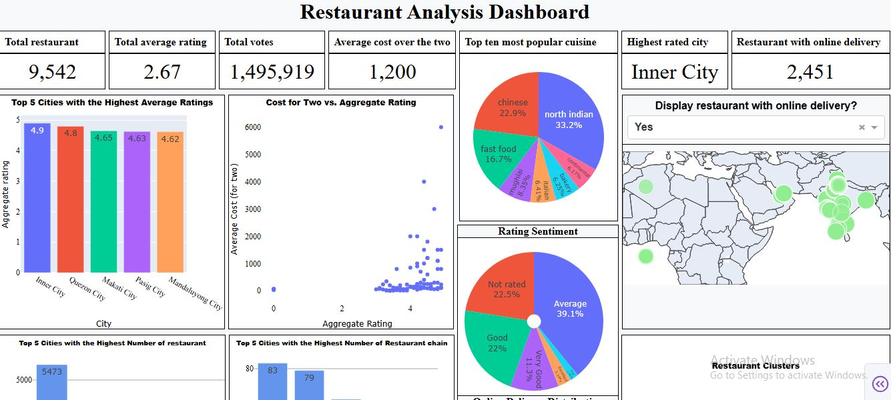
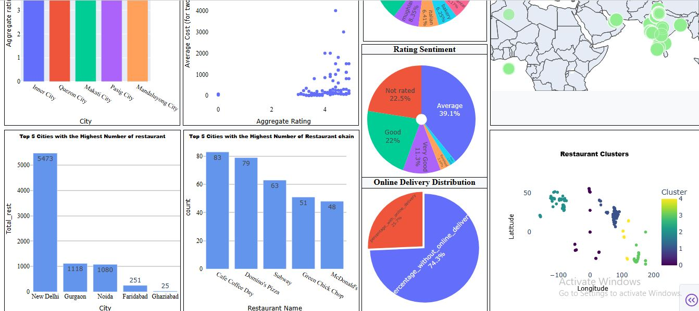

# Cognifyz Restaurant data analysis and Dashboard

An interactive dashboard built using Dash & Plotly to explore restaurant data.

# This is the dashboard image


## Features
- Geo-visualization of restaurant locations
- Ratings sentiment analysis
- Top city breakdown
- Online delivery insights
- Average cost for two vs Average rating
- Top 5 cities with highest rating
- Top 5 cities with most restaurants 
- and more

## Dependencies

- plotly
- matplotlib
- pandas
- numpy
- dash
- scikit-learn
- geopandas
- seaborn
- ipykernel
- ipython
- ipywidgets
- nbformat

## Installation
## Run Locally
```bash
pip install -r requirements.txt

